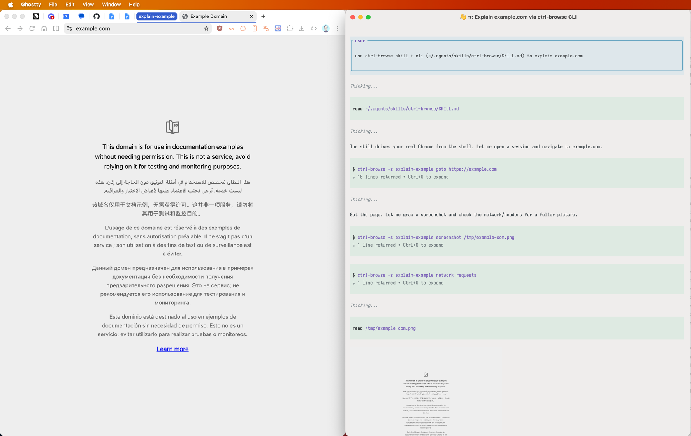

<p align="center"></p>

<h1 align="center">ctrl-browse</h1>

CLI for AI agents (and you) to drive your **real** Chrome: your profile,
logins, extensions. No bundled browser, no headless mode, no debug flags. Made to fit my specific use-cases.

Each **session** is a **tab group** of the same name, so agents work
side by side without touching each other's tabs or yours.

<p align="center"></p>

```
ctrl-browse -s feature-a open localhost:3000   # creates tab group "feature-a"
ctrl-browse -s feature-a snapshot -i           # interactive elements with @refs
ctrl-browse -s feature-a click @e3
ctrl-browse -s feature-a close                 # closes group, ends session
```

> Whatever runs ctrl-browse **controls your everyday browser**: every
> logged-in site, page JavaScript, cookies, network traffic. 
> That's by design. See [Security](#security).

## Install

**Node 20+** (or Bun), **Chrome 116+**.

```bash
git clone https://github.com/vladstudio/ctrl-browse.git
cd ctrl-browse
npm install && npm link   # or: bun install && bun link
```

Extension: `chrome://extensions` → **Developer mode** (top right) → **Load
unpacked** → folder from `ctrl-browse extension-path`.

```bash
ctrl-browse status        # → browser: connected
```

The daemon starts on demand; the extension reconnects by itself. Chrome may be
open or closed.

## AI agents

[`skill/SKILL.md`](skill/SKILL.md) teaches commands, workflow and safety
rules. Claude Code:

```bash
mkdir -p ~/.claude/skills/ctrl-browse && cp skill/SKILL.md ~/.claude/skills/ctrl-browse/
```

Cursor, Codex, others: paste it into `AGENTS.md` or your rules file.

## Sessions

- `-s <name>` (or `CTRL_BROWSE_SESSION`) is required.
- A new name creates a colored tab group `<name>` with one tab.
- Sessions survive daemon and Chrome restarts: groups ctrl-browse created are
  re-bound by title. A name matching one of your own groups is an error.
  State: `~/.ctrl-browse/state.json`.
- Deleting the group or closing its last tab ends the session; `close` closes
  its tabs and ends it.
- `tab` commands manage several tabs per session, optionally `--label`ed.

## Commands

<!-- commands:start (generated by scripts/gen.js from src/spec.js) -->
```
sessions:
  sessions                        list sessions
  close                           close session (closes its tab group)
  status                          daemon + browser status
  shutdown                        stop the daemon, detaching every tab
  daemon install|uninstall        run daemon as a login service (macOS launchagent)
  extension-path                  folder to "Load unpacked" in chrome://extensions

navigation:
  open <url> | goto <url> [--limit n]
                                  navigate; prints the page as markdown
  back                            history back
  forward                         history forward
  reload
  wait <selector|@ref|ms>         element appears, or ms pass
  wait --text "Welcome"           text appears (substring)
  wait --text-gone "Loading…"     text disappears
  wait --gone <selector|@ref>     element disappears
  wait --fn "<js expression>"     expression becomes truthy
  wait --network-idle [ms]        nothing in flight, no traffic for ms (default 500)
  wait --load                     page load
                                  (all waits: --timeout ms, --interval ms)
                                  (--network-idle ignores streams and long-polls open >10s)

page:
  dom [--limit n]                 document HTML
  snapshot                        page outline with stable @refs
  snapshot -i                     interactive elements, @refs, aria state
  screenshot <path> [--full] [--scale n] [--max-width n] [--el <sel|@ref> [--pad px]]
                                  --el: crop to element, --pad: margin; --max-width never upscales
  viewport <w> <h> [--dpr n]      real viewport resize
  viewport reset                  undo viewport
  eval <js>                       run page JavaScript (awaits promises)
  get text|html <sel|@ref>        element text or inner HTML
  storage get|set|clear local|session <key> [value]
  scrollintoview <sel|@ref>

interact:
  click <sel|@ref> [--force]      trusted click at center, or a visible part if the
                                  center is covered; --force: center anyway
  fill <sel|@ref> <text>          clear + set value, fires input/change;
                                  contenteditable: select-all + trusted insert
  type <sel|@ref> <text> [--delay ms]
                                  real keystrokes, default delay 15ms
  press <key[+mod…]>              key or shortcut: Escape, Meta+a
  select <sel|@ref> <value|label>
  find role <role> [--name <s>] [--nth N] [click|show]
  find label <accessible name> [--nth N] [click|show]
  find text <text> [--nth N] [click|show]
                                  (--nth N: Nth match, 1-based)

mouse:
  mouse move <x> <y> [--duration ms] [--steps n] [--human --seed n]
  mouse down [left|right|middle] | mouse up [button]
  mouse wheel <dy> [dx]

tabs (inside the session):
  tab                             list tabs (tN, tabId, label)
  tab new [url] [--label L]       new tab in the session group
  tab <tN|label|tabId|title>      switch
  tab close [tN|label|tabId]      close (defaults to active)

console:
  console [--clear] [--since-nav] console messages
  errors [--clear] [--since-nav]  page errors
                                  (--since-nav: since last page load)

network:
  network route <pattern> [--abort] [--body json] [--status n] [--method M] [--times n] [--header "K: v"] [--content-type ct] [--resource-type t]
                                  --status alone: empty body; --times N: expire after N matches;
                                  CORS preflights answered, Origin echoed (credentialed mocks work)
  network unroute [pattern]
  network requests [--clear] [--filter pat] [--type xhr,fetch] [--method POST] [--status 2xx|200|400-499]
  network request <n|id>          headers + bodies of one request

global flags: -s/--session NAME (or CTRL_BROWSE_SESSION), --json, --timeout ms, --version
--raw (snapshot, tab, console, errors, network): show token-like url params, auth headers
selectors: CSS, or @eN refs from snapshot/find
text starting with "-": put it after --, e.g. fill #q -- --verbose
```
<!-- commands:end -->

`ctrl-browse help` prints this reference. Unknown flags, and flags a command
doesn't take, are errors.

## How it works

```
CLI ──ws──▶ daemon (127.0.0.1:9876) ──ws──▶ extension ──▶ chrome.debugger / tabs / tabGroups
```

- **CLI** (`bin/`): parses, starts the daemon if needed, prints the result.
- **Daemon** (`src/daemon.js`, `src/daemon/`): session state (group, active
  tab, labels, logs, mocks); every command over CDP. Commands and flags:
  `src/spec.js`; in-page code: `src/scripts/`.
- **Extension** (`src/extension/`): bridge executing `chrome.debugger`,
  `chrome.tabs`, `chrome.tabGroups` calls — hence your profile, always headed.

## Security

The daemon listens on `127.0.0.1` and checks each connection's `Origin`:

- **Web pages**: refused, DNS rebinding included.
- **Extensions**: only ctrl-browse's own ID (from the `key` in
  `manifest.json`) may act as the bridge.
- **Local programs** (no `Origin`): allowed, no credentials — Chrome's
  `--remote-debugging-port` model.

So:

- Any program running as you can drive your browser while the daemon runs.
  Stop it (`ctrl-browse shutdown`, `ctrl-browse daemon uninstall`) or use a
  separate Chrome profile.
- `127.0.0.1` is shared by all OS accounts: don't use ctrl-browse on a
  multi-user machine.
- A local program can pose as the extension (it can forge `Origin`; browsers
  can't) and return fake results — nothing beyond what it can do as a client.

## Notes

- Driven tabs show Chrome's "started debugging this browser" bar:
  `chrome.debugger` makes clicks, keys and network mocks trusted.
- With the daemon off, the extension's service worker logs
  `ERR_CONNECTION_REFUSED` per reconnect (Chrome logs these; JS can't hide
  them). macOS: `ctrl-browse daemon install` runs the daemon as a login
  service; `daemon uninstall` reverts to on-demand.
- Console and network tracking cover only tabs you've run commands against.
- `@eN` refs last while the element stays in the DOM; re-snapshot for new ones.
- Typed passwords never appear in output. Token-like URL params and
  auth/cookie headers show as `[REDACTED]` in `goto`, `snapshot`, `tab`,
  `console`, `errors`, `network`; `--raw` reveals them. `dom`, `get`, `eval`
  return raw content.
- After `git pull`, reload the extension at `chrome://extensions`; until then
  commands are refused. The daemon restarts itself when its code changes.
- Daemon log: `~/.ctrl-browse/daemon.log`.
- Page JS runs in the main frame's default world, so extension iframes
  (password managers) don't break commands.
- Opening DevTools on a tab detaches the debugger; the next command
  re-attaches.
- Forks with a new manifest `key` work: the daemon derives the extension ID.
- Other port: set `CTRL_BROWSE_PORT` and edit `PORT` in
  `src/extension/background.js`.

## Uninstall

```bash
npm unlink -g ctrl-browse   # or: bun unlink
rm -rf ~/.ctrl-browse       # optional: state and logs
```

Then remove the extension at `chrome://extensions`.

## Development

```bash
bun run test        # smoke (real daemon + CLI, fake extension), unit, in-page script tests; no Chrome
node test/smoke.js  # smoke test on Node
bun run e2e         # real extension in headless Chrome for Testing / Chromium (CHROME_BIN=…, E2E_HEADED=1 to watch)
bun run typecheck   # tsc over JSDoc-typed JS
bun run gen         # after editing src/spec.js or background.js: README reference + extension code stamp
bun src/daemon.js   # daemon in foreground
```

## License

[MIT](LICENSE)
